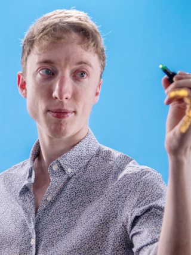

# Module Team

## Module Leadership

|  |  |
| ------------------------------ | ----------------------------------- |
| Andy Brand                     | Freddie Page                        |

Andy and Freddie are the module leaders. We set the strategy for the module, how it is run and assessed. Coordinate between all students and supervisors and run the operations of the module.

## Supervisors
Every member of the Design Engineering Teaching and Research staff is a potential supervisor for a Master's Project. You can find information about each of them, as well as their contact details, in the [Design Engineering Staff Page](https://www.imperial.ac.uk/design-engineering/people/academic--teaching-staff/).

## Independent Assessors
Each project will have two independent assessors, the first independent assessor is selected taking into account nominations from your supervisor, and the second independent assessor is selected from the distribution of Design Engineering academic staff.
